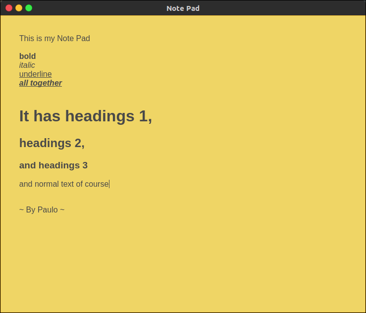

# NotePad

Simple note pad webapp, fully available offline. Don't use this, there are better ones out there ;)



## Key combinations

Here are the combinations available

* Ctrl + 1,2,3 applies headings 1, 2 or 3
* Ctrl + 0 turns any heading to normal text
* Ctrl + b,i,u applies bold, italic and underline

There are also the default system combintions

* Ctrl + z,x,c,v undo, cut, copy and paste

And for those ones who didn't know

* Ctrl + Shift + z re-do (undo the undone)

P.S. It auto-saves, so if you are a Ctrl + S addicted this might either help or freak you out!

## Installation

You can grab the folder for you OS from the [releases](https://github.com/raggesilver/NotePad/releases) page or you can download the whole thing (in which case you must have NodeJs and NPM installed) and:

```bash
npm install
npm start
```

## Contribute

Report bugs on the issues section, or if you are one of my friends who I force to test my shitty codes, privately also works!
